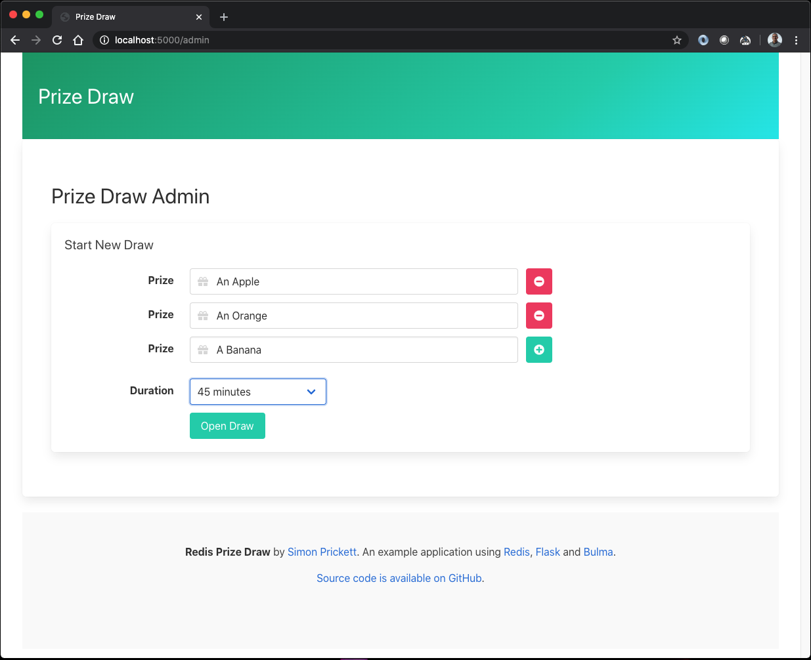
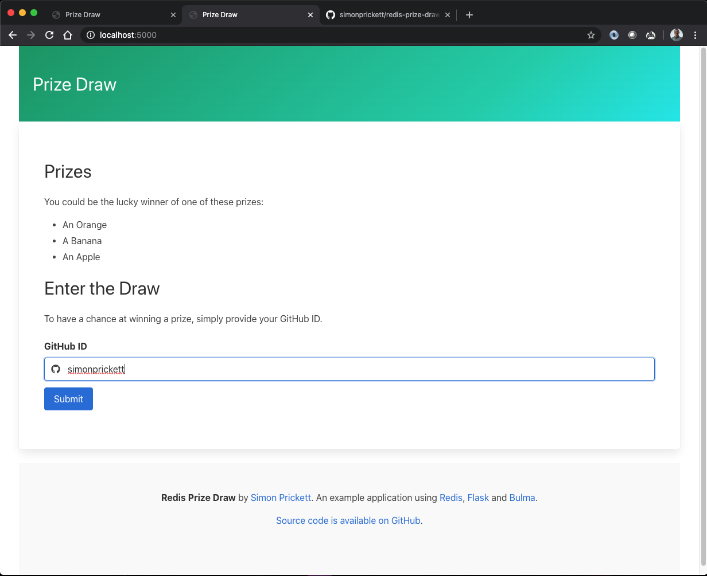
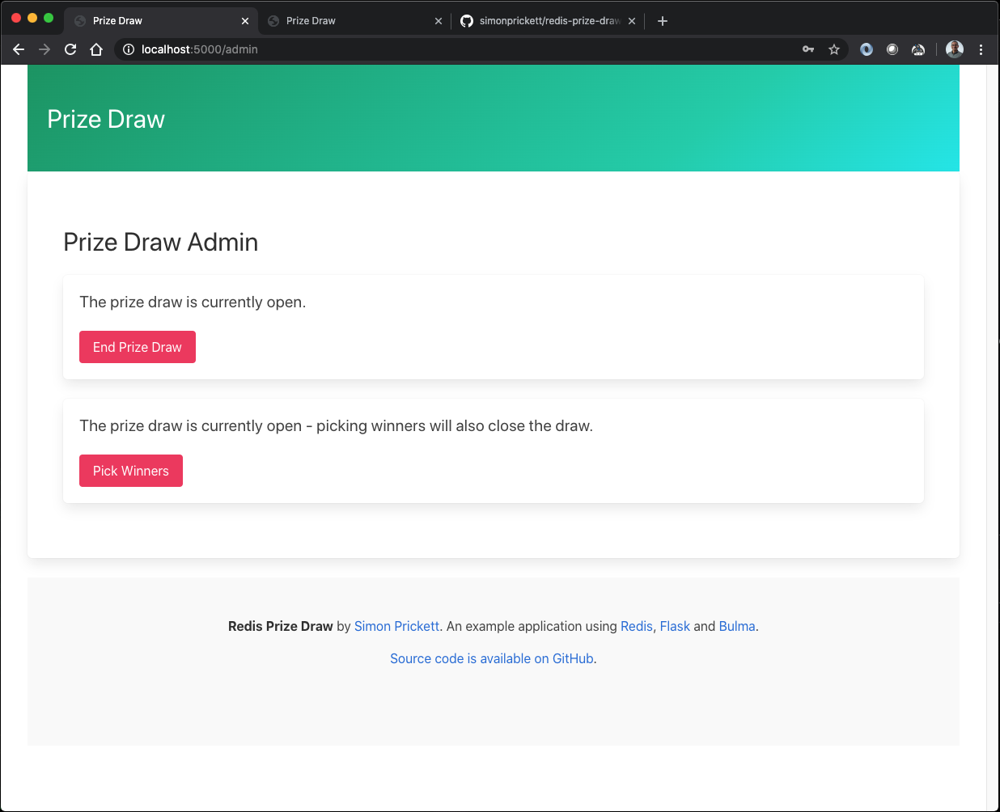

# Redis Prize Draw

An example application to run a simple online Prize Draw using Redis as the data store.  Implementations are included for:

* [Python](python/README.md) (Flask framework)
* [Node.js](node/README.md) (Express framework, EJS templates)

Both use Bulma for the front end, which is exactly the same for both implementations.  Watch a video presentation of this project for Women Who Code San Diego on YouTube [here](https://www.youtube.com/watch?v=iRY_D21rxVg).

# Overview

This is a demo application that manages a prize draw.  An administrator sets up a new draw by accessing the password protected admin page.  There, they can add prizes and set an optional duration for the draw after which no new entries will be accepted.

Once a draw has been configured, anyone with a GitHub account can enter it.  GitHub accounts are used to ensure unique entry names without collecting email addresses, and because GitHub allows access to basic profile details such as name and profile picture without having to authenticate to an API.  Here, a user enters the draw:

Once the draw has closed, the administrator presses the button to randomly pick winners.  The administrator can also choose to close the draw at any time, then pick winners.

Once winners have been picked, they are displayed on the home page:

# Redis Data Model

This codebase is designed to show how you could use Redis as a datastore for an application, rather than just as a cache.  Let's look at how data is stored and referenced at each step in the prize draw lifecycle.

## Key Management

The application uses `prizedraw` as the namespace for all of its keys, with `:` used as a separator inside key names.  The application will only change or delete keys that begin with `prizedraw:`.  Other data can live in the same Redis instance alongside data for this application, so long as other applications don't change or delete the `prizedraw` keys.

## Starting a New Prize Draw

Initially, we start out with no keys in the database for this application.  When the start draw form in the admin page is submitted, it first deletes keys relating to any prior draw:

* `prizedraw:entrants`
* `prizedraw:winners`
* `prizedraw:winners_json`
* `prizedraw:prizes`

(GitHub profile keys aren't deleted as they will all expire over time, and users who entered the last draw may come back and enter the new one, so keeping their profile information cached for a while makes sense).

Then it creates the following keys:

* `prizedraw:is_open`, a Redis string value set to `true`.  This is used to indicate that a prize draw is currently running.  If a time limit was set on the draw, this key will have a TTL set and the draw closes when it expires.  If no time limit was set, the draw closes when this key is deleted by closing the draw manually from the admin page.
* `prizedraw:prizes`, a Redis set containing each of the prizes as strings.  Note that because a set is used here, prizes have to have unique names as no duplicate members are allowed in a set.

## Entering a Prize Draw

When a user visits the home page and a prize draw is in progress (key `prizedraw:is_open` exists), they can enter their GitHub ID to enter.  The server code looks up the GitHub ID and gets a JSON object representing their profile if one exists.  Entering a draw creates/modifies these keys:

* `prizedraw:entrants`, a Redis set containing the GitHub IDs of each entrant as strings.  Note that because a set is used here, you can't enter the prize draw more than once!  The front end tells the user if they have already entered based on the return value of the Redis `SADD` command, which returns the number of new members added to the set.  If that's 0, we know the user's GitHub ID is already in the set and can tell them so.
* `prizedraw:profiles:<github id>`, these keys are created for each entrant.  They are Redis strings storing the JSON response from GitHub containing the entrant's profile pic, name etc.  For example the key for my profile would be `prizedraw:profiles:simonprickett`.  The profile information is stored in Redis as a cache, because the application uses it both when a new user enters the draw as well as when winners are drawn.  These keys are all set to expire after an hour, so that Redis doesn't fill up with profiles for users that are not part of the current prize draw over time. 
* Prizes are listed on the home page using the Redis `SMEMBERS` command against the set at `prizedraw:prizes`.

## Closing a Prize Draw

There are two ways to close a prize draw:

* If the draw had a time limit, the key `prizedraw:is_open` expires after that limit.  The draw is now closed and the front end will no longer accept new entrants.
* If the draw was set to run indefinitely, the key `prizedraw:is_open` is deleted when the button to close the draw on the admin page is pressed.

## Picking Winners

When the pick winners button on the admin page is pressed, winners are selected as follows:

* A prize is randomly selected and removed from `prizedraw:prizes` using the Redis `SPOP` command.
* A winner is randomly selected and removed from `prizedraw:entrants` using the Redis `SPOP` command.
* The prize and winner are then stored in a hash at `prizedraw:winners`.  The prize names are used as the field names in the hash, and the GitHub IDs of the winners are used as the field values.
* This process continues until we run out of either prizes or entrants, so the application deals with situations where there are more entrants than prizes and not everyone wins, as well as when there are more prizes than entrants and some prizes remain unwon.

## Viewing Results

When the user revisits the home page and `prizedraw:winners` exists in Redis, the server returns a JSON document containing the details of each winner and the prize they won.  This document includes details from the GitHub profile of the winners (real name, profile pic).  It's generated as follows:

* Check to see if the key `prizedraw:winners_json` exists, and returns JSON from that Redis string if it does (we cache the computed JSON for winners).  If that key doesn't exist, carry on...
* Using the Redis `HGETALL` command, the application gets all of the `Prize:GitHub ID` name value pairs from the hash at `prizedraw:winners`.
* It loops over these, and for each one:
  * Retrieves the cached GitHub profile from `prizedraw:profiles:<github id>`, parsing it as JSON and retrieving the real name and avatar URL fields if they exist.
  * Adds an object containing the winner's name, prize, and avatar URL to an array.
* Once all winners' details have been retrieved, the array containing them all is serialized to JSON and cached in a Redis key at `prizedraw:winners_json`, so that future calls to view the results can just return this without doing all the extra profile lookup work.

# Implementations

There are two example implementations included in this repository.  Both work the same way and expose the same API endpoints.  The front end code for both is identical.

Each implementation has its own `README.md` with details of how to get it up and running.

Both require you to have access to a Redis instance, this can be local or remote.

* [Python](python/README.md) (Flask framework)
* [Node.js](node/README.md) (Express framework, EJS templates)
