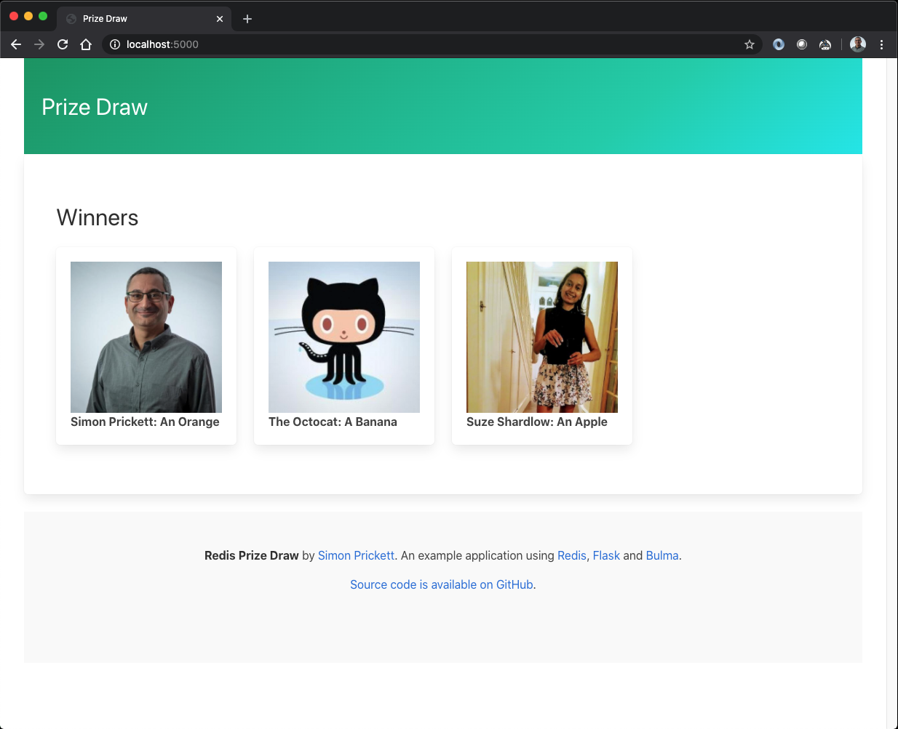

# Redis Prize Draw

An example application to run a simple online Prize Draw using Redis as the data store.  Implementations are included for:

* [Python](python/README.md) (Flask framework)
* [Node.js](node/README.md) (Express framework, EJS templates)

Both use Bulma for the front end, which is exactly the same for both implementations.

# Overview

This is a demo application that manages a prize draw.  An administrator sets up a new draw by accessing the password protected admin page.  There, they can add prizes and set an optional duration for the draw after which no new entries will be accepted.

Once a draw has been configured, anyone with a GitHub account can enter it.  GitHub accounts are used to ensure unique entry names without collecting email addresses, and because GitHub allows access to basic profile details such as name and profile picture without having to authenticate to an API.  Here, a user is entering the draw:

Once the draw has closed, the administrator presses the button to randomly pick winners.  The administrator can also choose to close the draw at any time, then pick winners.

Once winners have been picked, they are displayed on the home page:

# Data Model

TODO

# Implementations

There are two example implementations included in this repository.  Both work the same way and expose the same API endpoints.  The front end code for both is identical.

Each implementation has its own `README.md` with details of how to get it up and running.

Both require you to have access to a Redis instance, this can be local or remote.

* [Python](python/README.md) (Flask framework)
* [Node.js](node/README.md) (Express framework, EJS templates)